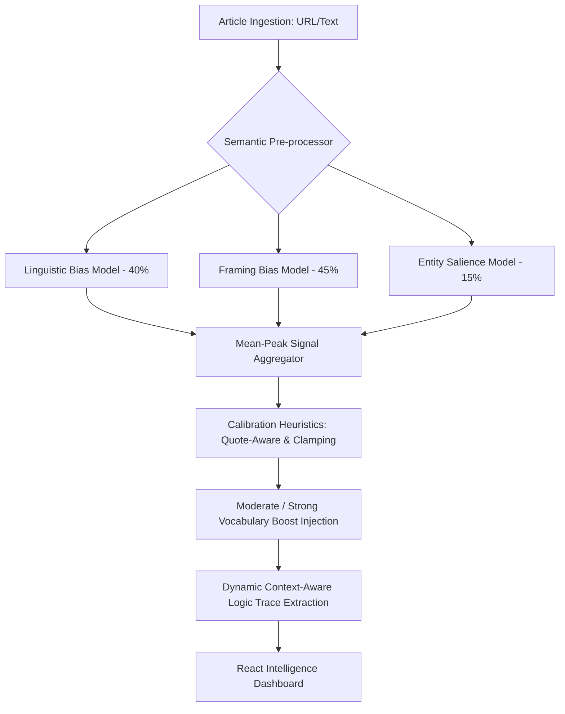

# TruthLens: Neural Media Bias Orchestration Platform


**TruthLens** is an advanced, enterprise-grade AI intelligence platform engineered to quantify and deconstruct ideological bias in global news media. Utilizing a multi-dimensional neural architecture, the platform traverses the layers of news reporting to expose linguistic slant, narrative framing, and entity-centric bias—delivering a transparent, data-driven audit of how information is curated and presented.

---

## 🚀 Core Value Proposition

In an era of hyper-polarized media, TruthLens serves as a **high-fidelity cognitive filter**, providing:
- **Real-Time Bias Auditing**: Instantaneous ingestion and analysis of live news metadata and content via a highly concurrent microservice backend.
- **Context-Aware Explainable AI (XAI)**: Moving far beyond "black-box" scores to extract literal quotes from source articles, generating mathematically-grounded logic traces.
- **Multidimensional Sentiment Vectors**: Dissecting bias across three calibrated axes: Linguistic (40%), Framing (45%), and Entity Salience (15%).
- **Semantic Nuance & Heuristics**: Capturing subtleties such as moderate vs. strong bias vocabulary, automatic objective reporting stabilization, and quote-aware damping.

---

## 🛠 Technical Architecture

TruthLens employs a robust microservice architecture designed for high-throughput NLP processing and deterministic explainability.



### 🧠 The Neural Stack
- **Linguistic Bias Model**: A customized **DistilBERT** transformer trained to detect loaded lexical choices.
- **Framing Model**: Analyzes sequence pairs to identify narrative prioritization, selective emphasis, and "angle" bias.
- **BEAD (Entity) Model**: Specialized salience detection to monitor how specific actors (politicians/orgs) are positioned within the text.

### ⚙️ Scoring Thresholds & Bands
Scores are stringently clamped and mapped to the following standard parameters:
- **>= 75**: Strong Bias
- **>= 60**: Moderate-High Bias
- **>= 40**: Moderate Bias
- **< 40**: Low Bias

---

## ⚡ Getting Started

To initialize the TruthLens Intelligence Environment, follow these steps:

### 1. Requirements
Ensure you have **Python 3.10+** and **Node.js 18+** installed.

### 2. Backend Initialization
The backend manages model inference, data persistence, and the analysis pipeline.
```bash
# Navigate to backend
cd backend

# Install dependencies
pip install -r requirements.txt

# Start the Intelligence API
uvicorn main:app --reload --port 8000
```
*API is accessible at:* `http://localhost:8000/docs`

### 3. Frontend Initialization
The React dashboard provides a premium, responsive interface for cognitive data visualization.
```bash
# Navigate to frontend
cd frontend/public

# Install dependencies
npm install

# Launch Development Server
npm run dev
```
*Dashboard is accessible at:* `http://localhost:5173`

---

## 📊 Feature Highlights

- **Dynamic Bias Indicators**: Replaces raw scores with high-impact "signifiers" (e.g., *Reckless, Catastrophic, Critical*) for intuitive understanding.
- **Context-Aware Logic Traces**: Instead of generic templates, TruthLens reads the article and quotes the exact offending sentences back to the user to justify its ML bias scoring.
- **Neural Source Profiling**: Fallback logic gracefully analyzes articles purely on framing and structure even when explicitly biased words are absent.
- **Cyber-Industrial UI**: A high-contrast, premium aesthetic constructed on Tailwind CSS and Framer Motion, utilizing grid-aligned spatial tracking and mesh gradients.

---

## 🛡 License & Disclaimer

TruthLens is intended for research and educational purposes. The bias scores are probabilistic estimates generated by neural models, stabilized by mathematical heuristics, and should be used as a supplementary tool for critical media consumption.

---
**Developed by the TruthLens Research Group // Neural Core v4.3**
