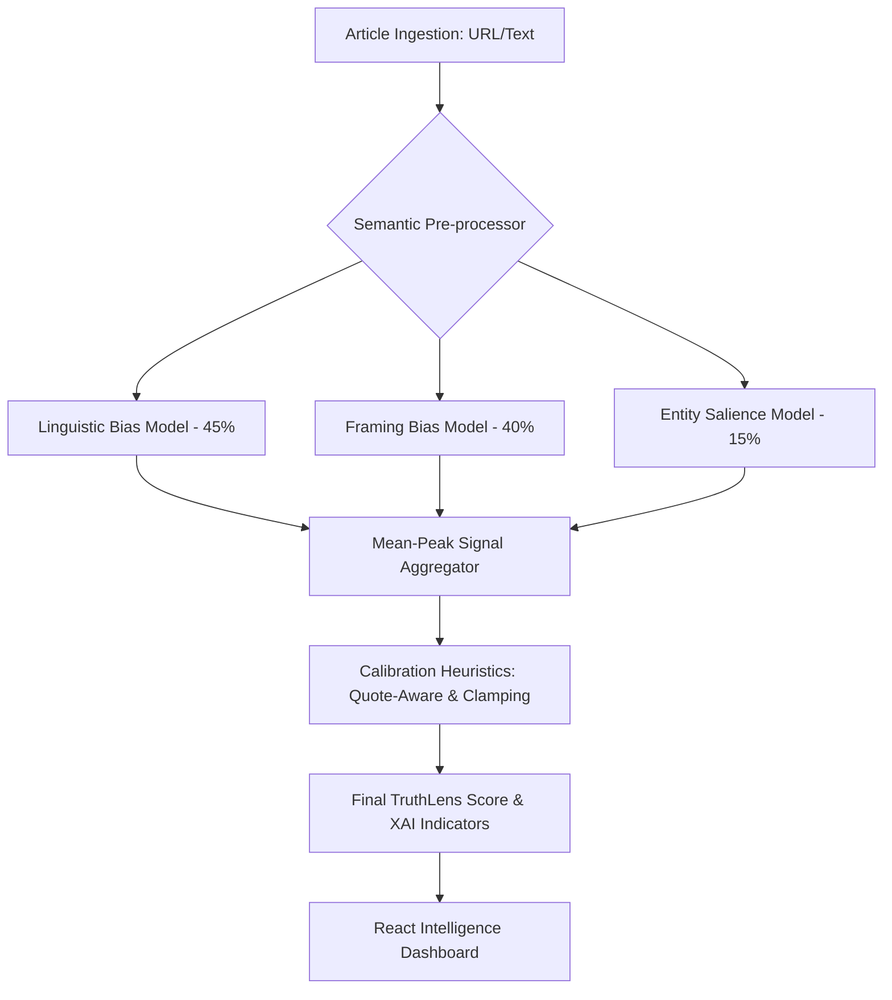

# TruthLens: Neural Media Bias Orchestration Platform


**TruthLens** is an advanced, AI-driven intelligence platform engineered to quantify and deconstruct ideological bias in global news media. Utilizing a multi-dimensional neural architecture, the platform traverses the layers of news reporting to expose linguistic slant, narrative framing, and entity-centric bias—delivering a transparent, data-driven audit of how information is curated and presented.

---

## 🚀 Core Value Proposition

In an era of hyper-polarized media, TruthLens serves as a **high-fidelity cognitive filter**, providing:
- **Real-Time Bias Auditing**: Instantaneous ingestion and analysis of live news metadata and content.
- **Explainable AI (XAI)**: Moving beyond "black-box" scores to provide human-readable **Bias Indicators**—flagging specific rhetorical triggers and narrative patterns.
- **Multidimensional Sentiment Vectors**: Dissecting bias across three distinct axes: Linguistic, Framing, and Entity Salience.
- **Neural Source Profiling**: Tracking longitudinal bias trends across global news organizations.

---

## 🛠 Technical Architecture

TruthLens employs a modular micro-service architecture designed for high-throughput NLP processing.



### 🧠 The Neural Stack
- **Linguistic Bias Model**: A customized **DistilBERT** transformer trained on 50k+ samples to detect loaded lexical choices.
- **Framing Model**: Analyzes sequence pairs to identify narrative prioritization and "angle" bias.
- **BEAD (Entity) Model**: Specialized salience detection to monitor how specific actors (politicians/orgs) are positioned within the text.

---

## ⚡ Getting Started

To initialize the TruthLens Intelligence Environment, follow these steps:

### 1. Requirements
Ensure you have **Python 3.10+** and **Node.js 18+** installed.

### 2. Backend Initialization
The backend manages model inference, data persistence, and the analysis pipeline.
```bash
# Navigate to backend
cd backend

# Install dependencies
pip install -r requirements.txt

# Start the Intelligence API
uvicorn main:app --reload --port 8000
```
*API is accessible at:* `http://localhost:8000/docs`

### 3. Frontend Initialization
The React dashboard provides a premium, interactive interface for data visualization.
```bash
# Navigate to frontend
cd frontend/public

# Install dependencies
npm install

# Launch Development Server
npm run dev
```
*Dashboard is accessible at:* `http://localhost:5173`

---

## 📊 Feature Highlights

- **Dynamic Bias Indicators**: Replaces raw scores with high-impact "signifiers" (e.g., *Tyrannical, Radical, Failure*) for intuitive understanding.
- **Logic Trace Analysis**: A step-by-step breakdown of why a specific score was assigned.
- **3D Geospatial Visualization**: (Optional) Interactive globe mapping bias vectors to geographic nodes.
- **Cyber-Industrial UI**: A high-contrast, premium interface designed for cognitive clarity and analytical depth.

---

## 🛡 License & Disclaimer

TruthLens is intended for research and educational purposes. The bias scores are probabilistic estimates generated by neural models and should be used as a supplementary tool for critical media consumption.

---
**Developed by the TruthLens Research Group // Neural Core v4.2**
