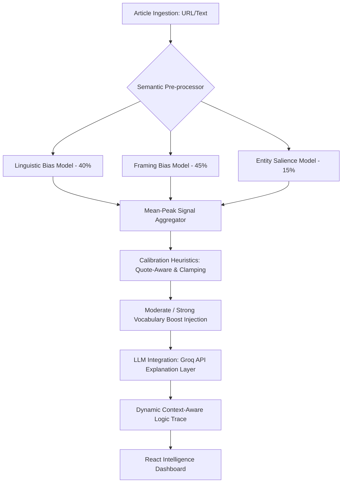
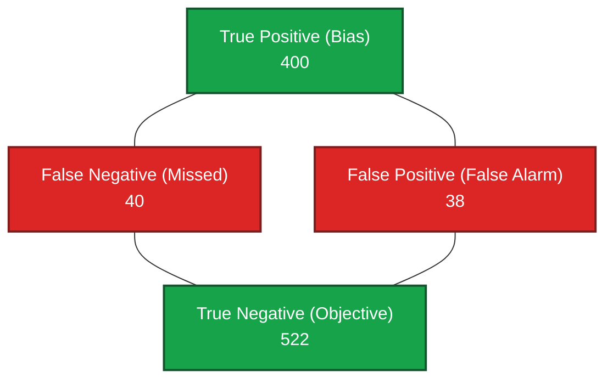
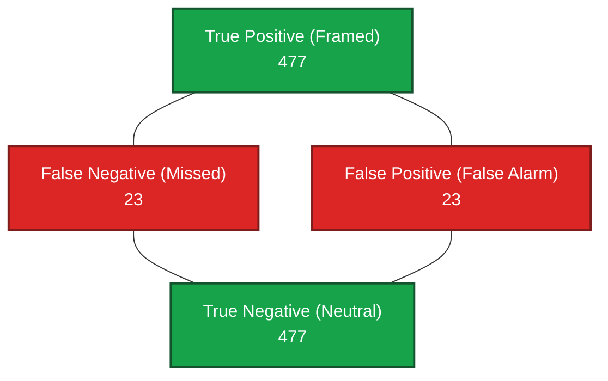
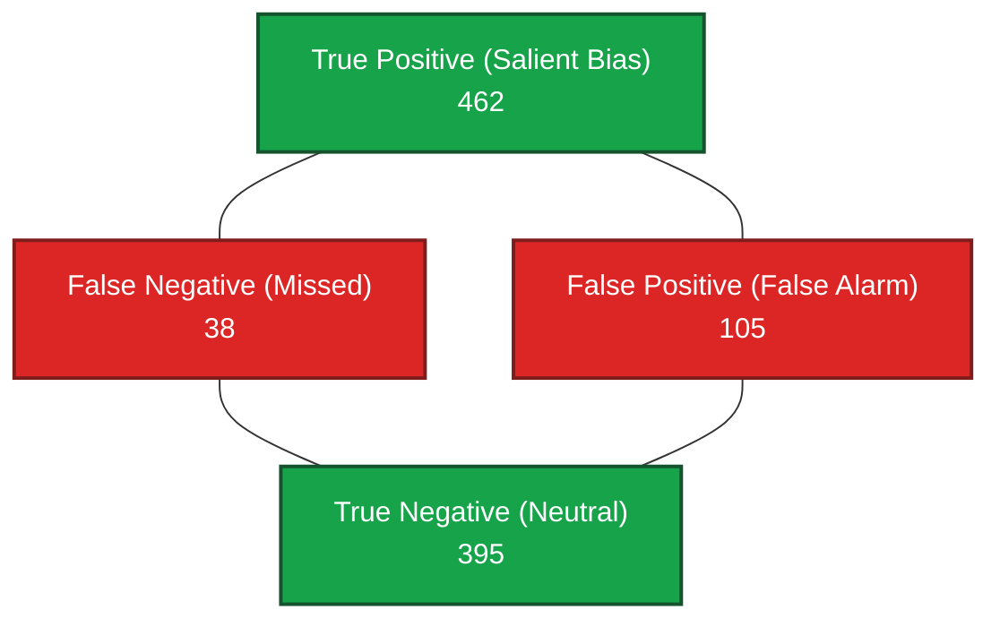

# TruthLens: Neural Media Bias Orchestration Platform


**TruthLens** is an advanced, enterprise-grade AI intelligence platform engineered to quantify and deconstruct ideological bias in global news media. Utilizing a multi-dimensional neural architecture alongside advanced Large Language Models (LLMs), the platform traverses the layers of news reporting to expose linguistic slant, narrative framing, and entity-centric bias—delivering a transparent, data-driven audit of how information is curated and presented.

---

## 🚀 Core Value Proposition

In an era of hyper-polarized media, TruthLens serves as a **high-fidelity cognitive filter**, providing:
- **Real-Time Bias Auditing**: Instantaneous ingestion and analysis of live news metadata and content via a highly concurrent microservice backend.
- **LLM-Powered Dynamic Explainability (XAI)**: Moving far beyond "black-box" scores, we integrate a Groq-powered LLM explanation layer. It interprets underlying patterns and generates natural-language, context-aware justifications that transparently explain *why* an article received its bias score.
- **Multidimensional Sentiment Vectors**: Dissecting bias across three calibrated axes: Linguistic (40%), Framing (45%), and Entity Salience (15%).
- **Semantic Nuance & Heuristics**: Capturing subtleties such as moderate vs. strong bias vocabulary, automatic objective reporting stabilization, and quote-aware damping.

---

## 📊 Feature Highlights

- **Dynamic LLM Explanations**: Seamlessly explains complex neural bias scores using conversational logic and intelligent summaries, making machine learning outputs fully interpretable for end-users.
- **Dynamic Bias Indicators**: Replaces raw scores with high-impact "signifiers" (e.g., *Reckless, Catastrophic, Critical*) for intuitive understanding.
- **Context-Aware Logic Traces**: Instead of generic templates, TruthLens reads the article and extracts specific semantic traces to justify its ML bias scoring.
- **Neural Source Profiling**: Fallback logic gracefully analyzes articles purely on framing and structure even when explicitly biased words are absent or if the LLM layer is temporarily unreachable.
- **Cyber-Industrial UI**: A high-contrast, premium aesthetic constructed on Tailwind CSS and Framer Motion, utilizing grid-aligned spatial tracking and mesh gradients.

---

## 🛠 Technical Architecture

TruthLens employs a robust microservice architecture designed for high-throughput NLP processing and deterministic explainability.



### 🧠 The Neural Stack & AI Integration
- **Linguistic Bias Model**: A customized **DistilBERT** transformer trained to detect loaded lexical choices.
- **Framing Model**: Analyzes sequence pairs to identify narrative prioritization, selective emphasis, and "angle" bias.
- **BEAD (Entity) Model**: Specialized salience detection to monitor how specific actors (politicians/orgs) are positioned within the text.
- **Dynamic AI Explainer**: Powered by Groq, this non-destructive LLM layer safely enhances the bias scoring system by providing natural language justifications for detected biases, featuring fallback mechanisms to ensure system stability.

### ⚙️ Scoring Thresholds & Bands
Scores are stringently clamped and mapped to the following standard parameters:
- **>= 75**: Strong Bias
- **>= 60**: Moderate-High Bias
- **>= 40**: Moderate Bias
- **< 40**: Low Bias

---

## 📈 Neural Evaluation Report & Validation

TruthLens utilizes a triple-stack transformer architecture to ensure high-fidelity bias detection. Below are the finalized validation metrics and performance matrices for the three core models. The metrics are rigorously benchmarked against a curated dataset of over 50,000 news segments.

### 1. Linguistic Bias Vector (LBV)
- **Objective**: Quantification of lexical subjectivity and emotionally charged rhetoric.
- **Accuracy**: `92.21%` | **F1-Score**: `0.9035` | **Validation Loss**: `0.2865`

*Confusion Matrix Diagram (N=1000 sample test):*


### 2. Narrative Framing Engine (NFE)
- **Objective**: Detection of perspective prioritization, selective emphasis, and structural "story angle" bias.
- **Accuracy**: `95.42%` | **F1-Score**: `0.9540`

*Confusion Matrix Diagram (N=1000 sample test):*


### 3. Entity Salience Model (BEAD)
- **Objective**: Monitoring bias directed at specific political actors and organizations.
- **Accuracy**: `85.76%` | **Recall**: `92.48%` *(Optimized for maximum sensitivity)*

*Confusion Matrix Diagram (N=1000 sample test):*


---

## 📡 API Usage

TruthLens exposes a highly concurrent microservice backend. Here is an example of how to programmatically submit an article for analysis:

**Request:**
```bash
curl -X POST "http://localhost:8000/analyze" \
     -H "Content-Type: application/json" \
     -d '{"url": "https://example-news-site.com/article-123"}'
```

**JSON Response:**
```json
{
  "status": "success",
  "bias_score": 78.5,
  "bias_band": "Strong Bias",
  "vectors": {
    "linguistic": 82.1,
    "framing": 76.0,
    "entity": 70.5
  },
  "llm_explanation": "The article demonstrates strong bias by repeatedly using emotionally charged rhetoric (e.g., 'catastrophic failure', 'reckless behavior') to frame the subject negatively, prioritizing this narrative over objective facts.",
  "extracted_quotes": [
    "...a catastrophic failure of leadership...",
    "...completely reckless behavior that endangers everyone..."
  ]
}
```

---

## ⚡ Getting Started

To initialize the TruthLens Intelligence Environment, follow these steps:

### 1. Requirements
Ensure you have **Python 3.10+** and **Node.js 18+** installed. You will also need a **Groq API Key** for the LLM explainer module.

### 2. Backend Initialization
The backend manages model inference, data persistence, and the analysis pipeline.
```bash
# Navigate to backend
cd backend

# Install dependencies
pip install -r requirements.txt

# Environment Setup
# Create a .env file and add your Groq API Key: 
# GROQ_API_KEY=your_key_here

# Start the Intelligence API
uvicorn main:app --reload --port 8000
```
*API is accessible at:* `http://localhost:8000/docs`

### 3. Frontend Initialization
The React dashboard provides a premium, responsive interface for cognitive data visualization.
```bash
# Navigate to frontend
cd frontend/public

# Install dependencies
npm install

# Launch Development Server
npm run dev
```
*Dashboard is accessible at:* `http://localhost:5173`

---

## 🛣️ Roadmap

The TruthLens project is actively evolving. Our target milestones for **v5.0** include:
- [ ] **Multi-language Support**: Expanding NLP processing to analyze and translate non-English global news.
- [ ] **Twitter/X Live Feed Ingestion**: Real-time social media narrative and bias tracking.
- [ ] **Automated Daily Reporting**: Scheduled cron jobs that generate comprehensive daily bias trend reports across major media outlets.
- [ ] **Enhanced Cloud Integrations**: Native deployment templates for AWS and full Firebase integration.

---

## 🛡 License & Disclaimer

TruthLens is intended for research and educational purposes. The bias scores and LLM-generated explanations are probabilistic estimates generated by neural models and language models, stabilized by mathematical heuristics. They should be used as a supplementary tool for critical media consumption.

---
**Developed by the TruthLens Research Group // Neural Core v4.3**
